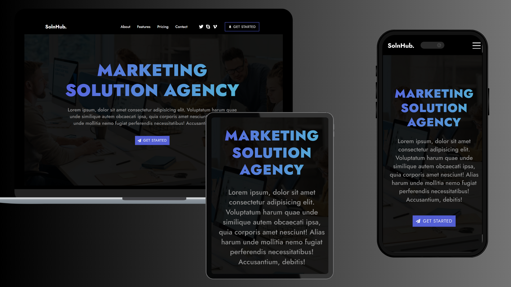

# 🌐 Landing Page Project

A responsive and modern landing page built with HTML, CSS, and React.  
This was part of my frontend developer learning journey — focused on layout, design, and responsiveness.

## 🚀 Live Demo
🔗 [View the Live Site](https://landing-page-ezequiel.vercel.app/)

## 🛠️ Tech Stack
- HTML5
- CSS3
- JavaScript/React
- Responsive Design
- [Vercel](https://vercel.com/) for deployment

## 📸 Screenshot
 

## 📦 Features
- Clean, modern UI
- Fully responsive layout (mobile/tablet/desktop)
- Smooth scroll & interactive elements
- Semantic HTML structure

## 🎯 What I Learned and Improved
- Structuring responsive layouts
- CSS styling + media queries
- Forms with the help of Formik Library
- DOM manipulation (if JavaScript is used)
- Version control with Git & GitHub
- Deploying projects with Netlify

## 📁 Getting Started
If you'd like to run the project locally:

```bash
git clone https://github.com/ezequielrabello/landing-page.git
cd landing-page
open index.html